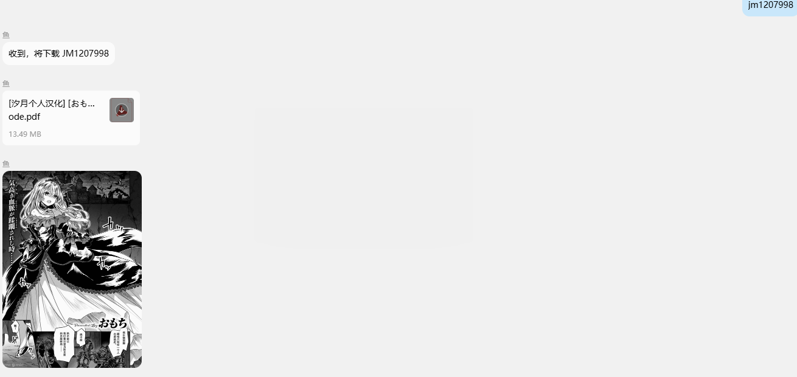

# QQBot 多插件项目

基于 NapCat + NoneBot2 的 QQ 机器人，支持多个插件。

## 插件列表

| 插件 | 说明 |
|------|------|
| **jmcomic** | 下载禁漫并生成 PDF 发送
| **pixiv** | Pixiv 搜索/下载/排行榜

## 快速开始
- [jmcomic 部署教程](help/jmcomic/教程.md)
- [pixiv 部署教程](help/pixiv/教程.md)

## Reference
- NapCat: https://napneko.github.io/guide/napcat
- JMComic: https://github.com/hect0x7/JMComic-Crawler-Python
- Nonebot: https://github.com/nonebot/nonebot2
- pixivpy: https://github.com/upbit/pixivpy