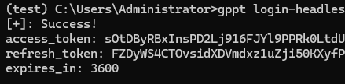

# Pixiv 插件

QQ Bot 的 Pixiv 图片搜索与下载插件，基于 [pixivpy3](https://github.com/upbit/pixivpy) 实现。

## 功能

- **搜索作品** - 按关键词搜索 Pixiv 插画
- **下载图片** - 下载并发送作品图片到群聊
- **排行榜** - 获取日榜/周榜/月榜
- **作品详情** - 查看作品的详细信息
- **快捷命令** - `px+ID` 一键下载

## 命令列表

| 命令 | 说明 | 示例 |
|------|------|------|
| `pixiv 搜索 <关键词>` | 搜索作品 | `pixiv 搜索 初音ミク` |
| `pixiv 下载 <ID或序号>` | 下载作品 | `pixiv 下载 139700179` |
| `pixiv 排行 [day/week/month]` | 获取排行榜 | `pixiv 排行 day` |
| `pixiv 详情 <ID>` | 查看详情 | `pixiv 详情 139700179` |
| `pixiv 帮助` | 显示帮助 | `pixiv 帮助` |
| `px<ID>` | 快捷下载 | `px139700179` |

### 开关控制

```
@机器人 开启 pixiv
@机器人 关闭 pixiv
@机器人 插件状态
```

## 安装配置

### 1. 安装依赖

```bash
pip install -r requirements.txt
playwright install chromium
```

### 2. 获取 refresh_token

由于 Pixiv 已废弃密码登录，必须使用 `refresh_token` 认证。

**方法一：使用 gppt 工具（推荐）**

```bash
# 安装
pip install gppt
pip install playwright
playwright install chromium
gppt login-headless -u <pixiv用户名> -p <pixiv密码>
```



**方法二：运行本插件提供的脚本**

```bash
cd hentaibot-Napcat-Nonebot/plugins/pixiv
python get_refresh_token.py
```

按提示操作：
1. 复制生成的 URL 到浏览器
2. 登录 Pixiv 账号
3. 在开发者工具中找到 `code` 参数
4. 快速粘贴回终端（30秒内）

### 3. 保存 token

将获取的 `refresh_token` 保存到：

```
/home/astrayao/qqBot/plugins/pixiv/my_refresh_token.txt
```

## 文件结构

```
plugins/pixiv/
├── __init__.py          # 命令处理（NoneBot2 插件入口）
├── service.py           # Pixiv API 封装
├── get_refresh_token.py # 获取 token 的工具脚本
├── my_refresh_token.txt # 你的 refresh_token（需自行创建）
├── downloads/           # 图片缓存目录
```

## 注意事项

### R18 内容

Pixiv 的 R18 作品可能被 QQ 风控拦截，导致图片发送失败。这是腾讯服务器端的审核，无法绑过。

### 图片发送限制

- 每次最多发送 9 张图片
- 多图作品会自动截取前 9 张
- 所有图片会保存在 `downloads/` 目录

## 常见问题

**Q: 提示"未找到 refresh_token"**
A: 请先运行 `get_refresh_token.py` 获取 token 并保存

**Q: 图片发送失败/超时**  
A: 可能是 QQ 风控或图片过大，R18 内容会被拦截

