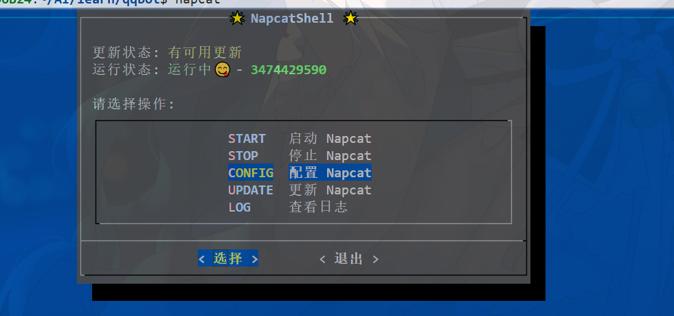
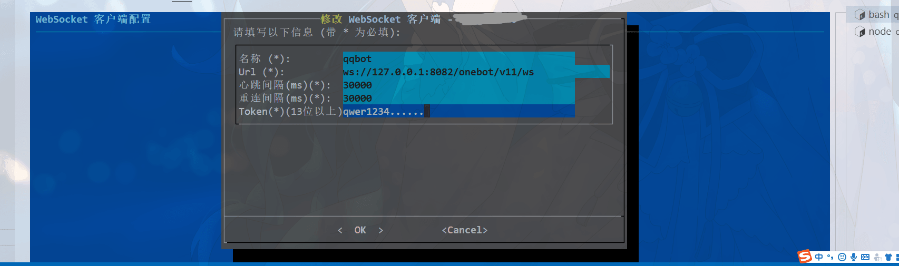
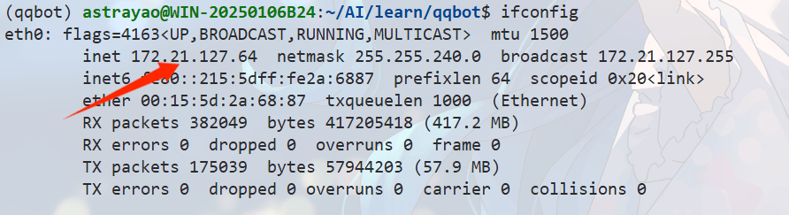
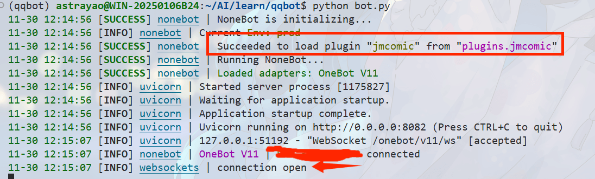

## 快速部署 QQBot（NapCat + NoneBot）

### 准备
- 克隆项目并安装依赖  
- python版本为3.11
  ```bash
  git clone https://github.com/HugTibers/qqbot-jm-Napcat-Nonebot.git
  cd qqbot-jm-Napcat-Nonebot
  pip install -r requirements.txt
  ```

### 安装 NapCat（Shell/Rootless）
执行安装脚本：
```bash
curl -o napcat.sh https://nclatest.znin.net/NapNeko/NapCat-Installer/main/script/install.sh && bash napcat.sh
```
- 安装方式选 Shell：输入 `n`
- 是否安装 NapCat TUI-CLI：建议 `y`

### 配置 NapCat
1) 终端运行 `napcat` 打开 NapCat Shell。  
2) 添加账号并扫码登录。  
3) 配置 WebSocket 反向客户端：  
   - URL：`ws://127.0.0.1:8082/onebot/v11/ws`  
   - Token：自行设置（需与 `.env` 的 `ONEBOT_ACCESS_TOKEN` 一致）  
   - 消息格式：数组  
   - 启用服务  

4) 配置WebUI
   - 这里的Token使用来登陆网页端的
   - 下一步用这里的Token登陆网页
截图参考：  
  



### 获取IP
有服务器的就用公网ip,我现在用的WSL测试
运行 `ifconfig` 查看 `eth0` 的 `inet`，如示例 `172.21.127.64`。  


### 打开 WebUI
浏览器访问 `http://<WSL_IP>:6099/webui`，使用刚才设置的 token 登录。  


### 验证 OneBot 反向 WS 配置
确认 WebSocket 客户端已连接，token 与 `.env` 保持一致。  


### 启动并测试机器人
```bash
python bot.py
```
看到 Uvicorn/NoneBot 正常日志即已运行。  
在群内 @机器人 发送 `jmhelp` 测试。  
  


## 使用 systemd 常驻运行（示例）
创建 `/etc/systemd/system/qqbot.service`（路径按需调整）：
```ini
[Unit]
Description=QQBot (NapCat + NoneBot)
After=network.target

[Service]
Type=simple
User=<your_user>
WorkingDirectory=/path/to/qqbot
Environment="PATH=/path/to/qqbot/.venv/bin:/usr/bin" 
ExecStart=/path/to/qqbot/.venv/bin/python bot.py
Restart=on-failure

[Install]
WantedBy=multi-user.target
```
命令参考：
```bash
sudo systemctl daemon-reload
sudo systemctl enable qqbot.service
sudo systemctl start qqbot.service
sudo journalctl -fu qqbot.service  # 查看日志
```
